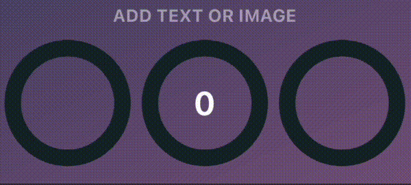

# Simple circular progress bar

<p>
  <a href="https://opensource.org/licenses/MIT">
    
  </a>
  <a href="https://pub.dev/packages/simple_circular_progress_bar/changelog">
    
  </a>
  <a href="https://docs.flutter.dev/development/tools/sdk/releases">
    
  </a>
  <a href="https://dart.dev/guides/whats-new">
    
  </a>
</p>

Open source Flutter package, simple circular progress bar.

# Getting Started
- [Installing](#Installing)
- [Basic Examples](#basic-examples)
    - [Colors](#colors)
    - [Start angle](#start-angle)
    - [Line thickness](#thickness-of-the-lines)
    - [Merge mode](#merge-mode)
    - [Animation time](#animation-time)
    - [Text Or Image](#text)
- [Value Notifier Example](#value-notifier-example)
- [Parameters description](#parameters-description)
- [YouTube video](#youtube-video)

# Installing
Add in pubspec.yaml:
```yaml
dependencies:
  flutter:
    sdk: flutter
  simple_circular_progress_bar: ^2.0.0
```

Now in your code, you can import:
```dart
import 'package:simple_circular_progress_bar/simple_circular_progress_bar.dart';
```

# Basic examples
See the full example [here](https://github.com/Nulllix/simple_circular_progress_bar/tree/master/example/lib).
*Most of the examples are in the rows_in_progress_bar_example folder.*

Example numbers correspond to their numbers in the code.
To quickly find examples in the repository, look in the code: 'EXAMPLE CODE'.

## Colors


<details>
    <summary><strong>Dart code</strong></summary>

```dart
// Example 1
SimpleCircularProgressBar(
    progressColors: const [Colors.cyan],
)

// Example 2
SimpleCircularProgressBar(
    progressColors: const [Colors.cyan, Colors.purple],
),

// Example 3
SimpleCircularProgressBar(
    progressColors: const [
        Colors.cyan,
        Colors.green,
        Colors.amberAccent,
        Colors.redAccent,
        Colors.purpleAccent
    ],
    backColor: Colors.blueGrey,
),
```
</details>

## Start angle


<details>
    <summary><strong>Dart code</strong></summary>

```dart
// Example 4
SimpleCircularProgressBar(
    startAngle: 45,
),

// Example 5
SimpleCircularProgressBar(
    startAngle: 90,
),

// Example 6
SimpleCircularProgressBar(
    startAngle: -180,
),
```
</details>
&nbsp;

## Thickness of the lines


<details>
    <summary><strong>Dart code</strong></summary>

```dart
// Example 7
SimpleCircularProgressBar(
    size: 80,
    progressStrokeWidth: 25,
    backStrokeWidth: 25,
),

// Example 8
SimpleCircularProgressBar(
    progressStrokeWidth: 20,
    backStrokeWidth: 10,
),

// Example 9
SimpleCircularProgressBar(
    backStrokeWidth: 0,
),
```
</details>

## Merge mode


<details>
    <summary><strong>Dart code</strong></summary>

```dart
// Example 10
SimpleCircularProgressBar(
    progressColors: const [Colors.cyan],
    mergeMode: true,
),

// Example 11
SimpleCircularProgressBar(
    progressColors: const [Colors.cyan],
    fullProgressColor: Colors.deepOrangeAccent,
    mergeMode: true,
),

// Example 12
SimpleCircularProgressBar(
    progressColors: const [Colors.cyan, Colors.purpleAccent],
    mergeMode: true,
),
```
</details>

## Animation time


*If you don't need animation, set animationDuration = 0.*

<details>
    <summary><strong>Dart code</strong></summary>

```dart
// Example 13
SimpleCircularProgressBar(
    mergeMode: true,
    animationDuration: const Duration(milliseconds: 500),
),

// Example 14
SimpleCircularProgressBar(
    mergeMode: true,
    animationDuration: const Duration(seconds: 3),
),

// Example 15
SimpleCircularProgressBar(
    mergeMode: true,
    animationDuration: const Duration(minutes: 1),
),
```
</details>

## Text


<details>
    <summary><strong>Dart code</strong></summary>

```dart
// Example 16
SimpleCircularProgressBar(
  valueNotifier: valueNotifier,
  mergeMode: true,
  centerChild: (double value, double maxValue) {
    TextStyle centerTextStyle = TextStyle(
      fontSize: 16,
      fontWeight: FontWeight.bold,
      color: Colors.greenAccent.withOpacity(value * 0.01),
    );

    return Row(
      children: [
        Icon(
          value == maxValue
          ? Icons.download_done
          : Icons.downloading,
          color: Colors.greenAccent.withOpacity(value * 0.01),
        ),
        const SizedBox(width: 4),
        Text(
          '${value.toInt()}%',
          style: centerTextStyle,
        ),
      ],
    );
  },
),

// Example 17
SimpleCircularProgressBar(
    valueNotifier: valueNotifier,
    mergeMode: true,
    onGetText: (double value, double maxValue) {
        return Text(
            '${value.toInt()}',
            style: const TextStyle(
                fontSize: 30,
                fontWeight: FontWeight.bold,
                color: Colors.white,
            ),
        );
    },
),

// Example 18
SimpleCircularProgressBar(
    valueNotifier: valueNotifier,
    mergeMode: true,
    onGetText: (double value, double maxValue) {
        TextStyle centerTextStyle = TextStyle(
            fontSize: 30,
            fontWeight: FontWeight.bold,
            color: Colors.greenAccent.withOpacity(value * 0.01),
        );
        
        return Text(
            '${value.toInt()}',
            style: centerTextStyle,
        );
    },
),
```
</details>

# Value Notifier Example


You can read about how ValueNotifier works [here](https://medium.com/@avnishnishad/flutter-communication-between-widgets-using-valuenotifier-and-valuelistenablebuilder-b51ef627a58b).

The source code of the example can be found [here](https://github.com/Nulllix/simple_circular_progress_bar/blob/master/example/lib/value_notifier_example.dart).

# Parameters description

| Parameter                                        | Default              | Description                                                                                                                                                                                       |
|--------------------------------------------------|----------------------|---------------------------------------------------------------------------------------------------------------------------------------------------------------------------------------------------|
| **size** <br>*double*                            | 100                  | Widget size.                                                                                                                                                                                      |
| **maxValue**<br>*double*                         | 100                  | The maximum value of the progress bar. The values will vary from 0 to [maxValue].                                                                                                                 |
| **startAngle**<br>*double*                       | 0                    | The angle from which the countdown of progress begins.                                                                                                                                            |
| **progressStrokeWidth**<br>*double*              | 15                   | Thickness of the progress line.                                                                                                                                                                   |
| **backStrokeWidth**<br>*double*                  | 15                   | Line thickness of the background circle. If you don't need a background circle, set this parameter to 0.                                                                                          |
| **progressColors**<br>*List<Color>*              |                      | Progress bar can be either with or without a gradient. For a gradient, specify more than one color in the [progressColors] field and if a gradient is not needed specify only one color.          |
| **fullProgressColor**<br>*Color*                 |                      | The color of the circle at 100% value. It only works when [mergeMode] equal to true.                                                                                                              |
| **backColor**<br>*Color*                         |                      | The color of the background circle.                                                                                                                                                               |
| **animationDuration**<br>*int*                   | Duration(seconds: 6) | Animation duration. If you don't need animation, set this parameter to zero Duration.                                                                                                             |
| **mergeMode**<br>*bool*                          | false                | When this mode is enabled the progress bar with a 100% value forms a full circle with [fullProgressColor]. If no [fullProgressColor] is specified, the last color from [progressColors] is taken. |
| **valueNotifier**<br>*ValueNotifier<double>*     |                      | The object designed to update the value of the progress bar. By default, creates a ValueNotifier with the maximum value.                                                                          |
| **onGetText**<br>*Text Function(double, double)* |                      | Callback to generate a new Text widget located in the center of the progress bar. The callback input is the current value and the maxValue of the progress bar.                                   |
| **centerChild**<br>*Text Function(double, double)* |                      | Widget located in the center of the progress bar. The callback input is the current value and the max value of the progress.                                                                      |

# YouTube video
You can see how the application works from the example in this [video](https://youtube.com/shorts/kKYyNAk2FMM).